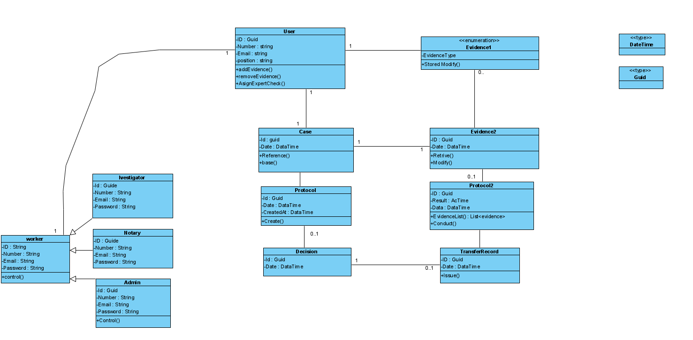
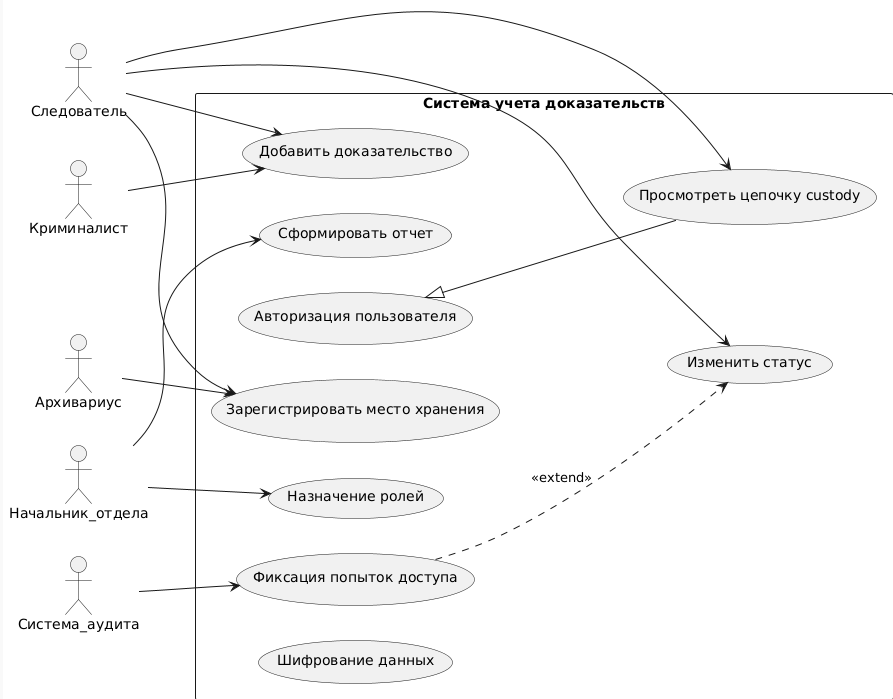

Система учёта доказательств в уголовных делах

📌 Описание проекта

Данный проект представляет собой программную платформу для учёта и контроля за судебными доказательствами в рамках уголовных дел. Цель разработки — исключить риски утери, подмены или несанкционированного доступа к доказательствам, а также обеспечить прозрачность и подотчётность всех действий с ними.

Система реализована как визуальное приложение с ролевым доступом (следователь, нотариус, судья, администратор и др.) и удобным пользовательским интерфейсом.

🧩 Решаемая проблема

В традиционных системах учёта доказательств нередко отсутствует надёжная цифровая прослеживаемость всех операций с объектами. Это приводит к следующим проблемам:
 • Возможность подмены или утраты доказательств
 • Недостаточная защищённость от несанкционированного доступа
 • Отсутствие полной хронологии действий с доказательствами
 • Зависимость от бумажного документооборота

Проект решает эти проблемы за счёт цифровой фиксации всех операций, разграничения прав доступа, и встроенной системы логирования.

⚙️ Основной функционал
 • Регистрация и аутентификация пользователей по ролям
 • Добавление, редактирование и подтверждение доказательств
 • Поиск и фильтрация доказательств по делу, дате, статусу и другим критериям
 • Просмотр истории изменений и действий с каждым доказательством
 • Защита данных и контроль доступа на уровне ролей
 • Ведение журнала аудита

📈 Используемые диаграммы UML

Для описания архитектуры и логики проекта были выбраны следующие типы диаграмм UML:

1. Диаграмма вариантов использования (Use Case Diagram)

Показывает, какие действия доступны каждой роли (следователь, нотариус, судья, администратор). Помогает определить границы системы и ключевые функции для каждого пользователя.

Зачем нужна: позволяет быстро понять, какие сценарии реализованы и кто может их запускать.


2. Диаграмма классов (Class Diagram)

Отображает основные сущности системы: Пользователь, Доказательство, УголовноеДело, ИсторияДействий, Роль и связи между ними.

Зачем нужна: помогает понять структуру кода, отношения между объектами и будущую реализацию базы данных и бизнес-логики.


3. Диаграмма последовательности (Sequence Diagram)

Показывает, как происходит взаимодействие между участниками системы при добавлении и подтверждении доказательства. Включает проверку авторизации, работу с БД, журнал аудита и пользовательский интерфейс.

Зачем нужна: позволяет визуализировать поведение системы во времени, наглядно показать поток вызовов и обмен данными между компонентами.


📚 Как диаграммы помогают понять архитектуру

Эти диаграммы в совокупности дают полное представление о системе:
 • Диаграммы вариантов использования — что именно делает система и кто её использует
 • Диаграмма классов — из чего состоит система и как связаны её компоненты
 • Диаграмма последовательности — как происходит взаимодействие между объектами при выполнении операций

Благодаря этому проект легко масштабировать, документировать и передавать другим разработчикам
-------------------------------------------------
## 🗂️ Структура базы данных (SQLite)

Система использует SQLite и содержит 8 таблиц:

- Users — пользователи системы (следователь, судья, нотариус и др.)
- Roles — роли пользователей
- Cases — уголовные дела
- Evidence — доказательства, прикреплённые к делам
- EvidenceHistory — лог действий над доказательствами
- AccessLog — один к одному: последний вход каждого пользователя
- Tags — теги для классификации улик
- Evidence_Tags — связь между уликами и тегами (многие ко многим)

### Типы связей:
- Один к одному: Users ↔ AccessLog
- Один ко многим: Users → Evidence, Cases → Evidence
- Многие ко многим: Evidence ↔ Tags через Evidence_Tags

База данных спроектирована для обеспечения надёжного контроля за уликами, отслеживания их истории и разграничения доступа по ролям.

# Система учета доказательств в уголовных делах (3этап)

## Цель
Обеспечить надежный учет, исключить подмену, утерю и несанкционированный доступ к доказательствам.

## Основные команды интерфейса

- 1. Добавить доказательство — вводит новое доказательство (название, описание).
- 2. Показать все доказательства — выводит весь список.
- 3. Найти по ID — позволяет найти конкретное доказательство.
- 4. Удалить по ID — удаляет выбранное доказательство.
- 0. Выход — завершение работы.

## Обработка ошибок
- Неверный ввод ID — сообщение об ошибке.
- Ошибки (например, отсутствие доказательств) — через try/catch.

## Сборка и запуск

```bash
dotnet build
dotnet run

📁 Компоненты слоя

🔹 EvidenceDbContext.cs

Основной класс взаимодействия с БД. Реализует CRUD-операции:
Метод
Назначение
GetAllAsync()
Получить список всех доказательств
GetByIdAsync(int id)
Найти доказательство по его идентификатору
AddAsync(evidence)
Добавить новое доказательство
DeleteAsync(int id)
Удалить доказательство по идентификатору

Автоматически создаёт таблицу Evidence, если она не существует.

⸻

🛠️ Используемые технологии
 • SQLite — встраиваемая база данных, создающая файл evidence.db в корне проекта.
 • Dapper — облегчённая ORM-библиотека для удобной работы с SQL-запросами.
 • Все методы взаимодействия с базой асинхронны (async/await), что улучшает производительность.
 • Используется обработка ошибок (например, при потере соединения или некорректных данных).

⸻

📦 Модель данных

Модель данных описана в файле Models/Evidence.cs:

public class Evidence
{
    public int Id { get; set; }              // Уникальный идентификатор
    public string Name { get; set; } = "";   // Название доказательства
    public string Description { get; set; } = ""; // Описание
}
⚙️ Пример создания таблицы

SQL-запрос, автоматически выполняемый при первом запуске:

CREATE TABLE IF NOT EXISTS Evidence (
    Id INTEGER PRIMARY KEY AUTOINCREMENT,
    Name TEXT NOT NULL,
    Description TEXT
);

